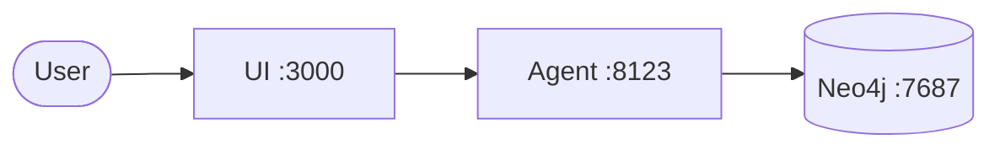

# Org Chat

Find subject matter experts in your organization by querying a knowledge graph of JIRA tickets. Have you ever needed help with something but didnt know who to ask? Rather than go on a goose chase, chat with this tool which uses ingested Jira data to make educated guesses to your questions about your coworkers.

## Prerequisites

### For Docker Setup (Recommended)

- [Docker Desktop](https://docs.docker.com/get-docker/) or [Podman](https://podman.io/getting-started/installation)
- Docker Compose (included with Docker Desktop)
- **6GB+ RAM** allocated to Docker/Podman (for Neo4j)
- An OpenAI or Anthropic API key
- Neo4j database files (ask a team member for the `neo4jdata` folder)

> **Podman users:** Ensure your VM has enough memory:
> ```bash
> podman machine stop && podman machine set --memory 6144 && podman machine start
> ```

### For Local Development

- Node.js 20+
- Python 3.11+
- [uv](https://docs.astral.sh/uv/getting-started/installation/) (Python package manager)
- An OpenAI or Anthropic API key

## Quick Start

### Setup

1. **Get the database files** - Place Neo4j data in `data/neo4jdata/`

2. **Configure environment**
   ```bash
   cp .env.example .env
   # Edit .env and add your API key (OPENAI_API_KEY or ANTHROPIC_API_KEY)
   ```

3. **Start services**
   ```bash
   docker compose up -d
   ```

4. **Open the app** - http://localhost:3000

### Services

| Service | URL | Description |
|---------|-----|-------------|
| UI | http://localhost:3000 | Web interface |
| Agent | http://localhost:8123 | LangGraph agent |
| Neo4j | http://localhost:7474 | Database browser |

### Commands

```bash
docker compose up -d      # Start all services
docker compose logs -f    # View logs
docker compose down       # Stop all services
docker compose up --build # Rebuild after changes
```

## Development

For local development without Docker:

```bash
npm install           # Install dependencies
npm run dev           # Start UI + agent
```

### Testing

```bash
npm run test          # Unit tests
npm run test:e2e      # E2E tests
npm run lint          # Linting
```

## Architecture



| Component | Technology | Description |
|-----------|------------|-------------|
| **UI** | Next.js + CopilotKit | Chat interface |
| **Agent** | LangGraph + Python | Expert-finding tools |
| **Neo4j** | Graph Database | JIRA tickets & relationships |

## Documentation

- [CopilotKit Docs](https://docs.copilotkit.ai)
- [LangGraph Docs](https://langchain-ai.github.io/langgraph/)
- [AGENTS.md](./AGENTS.md) - AI agent context for this codebase

## License

[MIT](./LICENSE)
